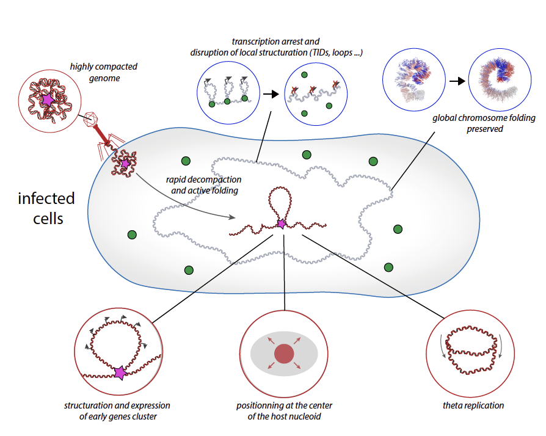
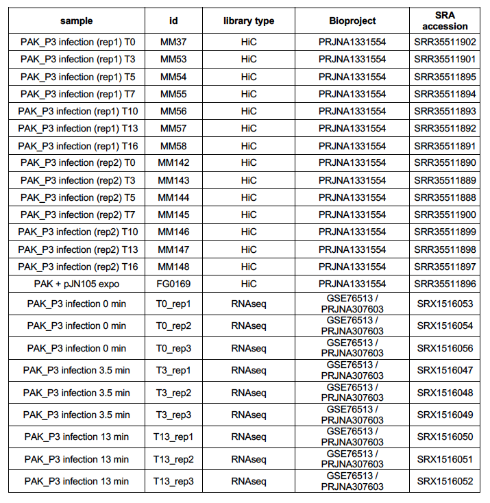

# PAK_P3_infection_analysis

this set of scripts is dedicated to the analysis of PAK_P3 infection cycle and refered to the publication:
"Bacteriophage PAK_P3 genome structuration and dynamics during infection of Pseudomonas aeruginosa reveal specific interactions patterns"

<p align="center">
  
</p>

## dataset

all the HiC reads can be downloaded on SRA using the following Bioproject reference: PRJNA1331554
The RNA seq reads from Chevalereau et al. 2016 can be downloaded on the NCBI GEO portal (GSE76513).
The FastA reference file can be downloaded directly from the github.

<p align="center">
  
</p>

if you want to skip the generation of raw data files (mcool, bigwig, bed and pdb files), you can find them on the following Zenodo repository : 
10.5281/zenodo.17529627

[dataset](https://doi.org/10.5281/zenodo.17529627)


## dependencies

- [Hicstuff](https://github.com/koszullab/hicstuff)
- [cooler](https://github.com/open2c/cooler)
- [HiCExperiment](https://github.com/js2264/HiCExperiment)
- [bowtie2](https://bowtie-bio.sourceforge.net/bowtie2/index.shtml)
- [tinymapper](https://github.com/js2264/tinyMapper)
- [bacchus](https://github.com/ABignaud/bacchus)
- [3D Genome Builder](https://github.com/data-fun/3d-genome-builder)
- [pymol](https://www.pymol.org/)

You will also need different R packages and python libraries that shoukd come along with the different dependencies.

## home made scripts and reference genome

Different scripts need to be downloaded from the github repository and put in a dedicated directory named [script].
you will also need the fasta and gff files for the two genomes and put them in a dedicated directory named [ref].


## Data generation

the first steps will be to generate the HiC mcool files and the RNA bigwig files.

### contact map construction (mcool files)

different argument need to be set (you will have to do that for the different libraries)

- genome=PAK_PAKP3.fa
- project=MM37
- reads_for=MM37_nvq_R1.fq.gz
- reads_rev=MM37_nvq_R2.fq.gz
- out_reads=MM37_digest
- cpu=64

first, pre-digest the reads using the cutsite module from hicstuff.

```sh
hicstuff cutsite -t "$cpu -1 "$reads_for" -2 "$reads_rev" -e "$enzyme" -p "$out_reads"
```
this command will create two fastq files named: MM37_digest_R1.fq.gz and MM37_digest_R2.fq.gz

Then, prepare the bowtie index for the alignment of the reads.

```sh
bowtie2-build "$genome" "$project"/index/idx
```
Launch the pipeline hicstuff to generate the mcool files 

```sh
hicstuff pipeline -t "$cpu" -D -d -f --plot -F --binning 500 --enzyme DpnII,HinfI -o "$project" -g "$project"/index/idx	"$out_reads"_R1.fq.gz "$out_reads"_R2.fq.gz
```
at this step, you should obtain a mcool file: MM37.mcool as well as other mandatory files to pursue the analysis like the distance law file: distance_law.txt

You have to obtain all the output files for the different libraries.
Several libraries have been sequenced on different lanes of sequencing apparatus (i.e. MM142, MM143 ...) and will need to be merged using cooler.
Be carefull to use the right reference genome for the different libraries (especially for the one with the plasmid pJN105).

```sh
cooler merge lib_merge_500bp.cool lib1.mcool::/resolutions/500 lib2.mcool::/resolutions/500 lib3.mcool::/resolutions/500
cooler zoomify -r 1000N --balance -o lib_merge.mcool lib_merge_500bp.cool
```

the following server can be another option to generate the mcool and pdb files : 

https://bioi2.i2bc.paris-saclay.fr/hicstuff/


### PDB files generation - 3D structure

to generate the PDB files, you can either install the 3DGB pipeline (https://github.com/data-fun/3d-genome-builder) or use the i2bc server (https://bioi2.i2bc.paris-saclay.fr/hicstuff/).

### RNAseq track generation (bigwig files)

```sh
tinyMapper.sh -m RNA -s "$work_dir"/fastq/RNA/"$project" -o "$work_dir"/RNA_track/"$project" -g "$work_dir"/fasta/deinoc_V2	--threads 24
```

## analysis

once you have obtained all the different raw files, you can go to the next part and start the analysis.
now you should organize your folder like this and put the different files in the dedicated directories:

```sh
mkdir -p rna_track/
mkdir -p mcool/
mkdir -p distance_law/
mkdir -p pdb/
mkdir -p ref/
mkdir -p plot/
mkdir -p script/
mkdir -p data_files/
```

### contact map generation for host and phage

contact map generation for the P. aeruginosa PAK (you can generate contact map at different resolutions)

```sh
script/plot_matrices_zoom.R mcool/lib.mcool 5000 LR657304.1:1-6395872 plot/lib_PAK_5kb.pdf   
```

contact map generation for the PAK_P3 phage 

```sh
script/plot_matrices_zoom.R mcool/lib.mcool 500 NC_022970.1:1-88097 plot/lib_PAKP3_500b.pdf  
```

you can obviously do a for loop to generate all the contact map for the different libraries and at different resolutions

```sh
for lib in MM53 MM54 MM55 MM56 MM57 MM58
do
  for resolution in 1000 2000 5000
  do
    script/plot_matrices_zoom.R mcool/"$lib".mcool "$resolution" LR657304.1:1-6395872 plot/"$lib"_PAK_5kb.pdf 
  done
  for resolution in 500 1000
  do
     script/plot_matrices_zoom.R mcool/"$lib".mcool "$resolution" NC_022970.13:1-88097 plot/"$lib"_PAKP3_5kb.pdf  
  done
done
```
### autocorrelartion contact map (Fig1.d)

```sh
script/plot_matrices_autocorrelation.R mcool/lib.mcool LR657304.1:2000000-3500000 plot/lib_PAK_5kb.pdf  
```

### Directionnal index (Fig1.a)

```sh
script/directionnal_index.R mcool/MM37.mcool LR657304.1:1-6395872 10000 10 plot/CID_MM37.pdf 
```

### HiC and RNA correlation (Fig1.a)

```sh
script/HiC_RNA_correlation.R mcool/MM37_filter.mcool 1000 LR657304.1:1-6395872 rna_track/T0_rep1_unstranded.bw 1000 plot/MM37_rep1_HiC_RNA_correlation.pdf
```

### pileup HiC - RNA (Fig1.c)

```sh
mkdir -p plot/pileup_MM37_rep1/
```

```sh
script/pileup_genes.py --rna-input rna_track/T0_rep1_unstranded.bw --annotation-input ref/PAK.gff --hic-input mcool/MM37_filter.mcool --binning 1000 --window 20000 --threshold 10 --circular yes --out-dir plot/pileup_MM37_rep1/
```

### RNA track plots

you can plot the different transcriptionnal signal using the following command line

```sh
script/RNA_track.R rna_track/T0_rep1_forward.bw rna_track/TT0_rep1_reverse.bw plot/RNA_T0_rep1.pdf LR657304.1:1-6395872 1 6395872 5000 ref/PAK.gff
```

### HiC and RNA track plots (Fig1.b)

another way to plot the transcription signal is to use the following command line that will plot the contact map and the RNA signal on the same plot.

```sh
script/HiC_RNAtrack.R mcool/MM37.mcool rna_track/T0_rep1_forward.bw rna_track/T0_rep1_reverse.bw ref/PAK.gff plot/RNA_HiC_rep1.pdf 500 LR657304.1:1950000-2050000 1950000 2050000 500
```

### distance law plots (Supp Fig.1 and Fig3)

plot of the distance law (i.e. p(s)) is a typical analysis of HiC data and is part of the hicstuff pipeline output. You can also genreate it from the pairs files (https://jserizay.com/OHCA/docs/devel/ - chapter 6).

in the present case and in order to plot all the data on the same plot, we will use the output [distance_law.txt] from hicstuff.

```sh
script/distance_law_plot.R plot/distance_law_PAKP3_rep1.pdf NC_022970.1 T0 distance_law/MM37_distance_law.txt T3 distance_law/MM53_distance_law.txt T5 distance_law/MM54_distance_law.txt T7 distance_law/MM55_distance_law.txt T10 distance_law/MM56_distance_law.txt T13 distance_law/MM57_distance_law.txt T16 distance_law/MM58_distance_law.txt
```

### 3D model

the output from 3DGB is not directly usable by the software pymol. We will modified it in order to add information of the links betweens the bins and add colors.

```sh
script/3D_PDB.sh pdb/MM53_raw.pdb pdb/MM53_treated.pdb
```

you can then load the pdb files in Pymol and use the script [visualize_genome.pml] to obtain the same structure are the ones in the paper.


### contact map comparison (Supp Fig.2)

one way to compare contact map in different conditions is to plot a log ratio of two contact map.

```sh
script/HiC_comparaison_zoom.R mcool/MM37.mcool mcool/MM57.mcool plot/MM37_vs_MM57_PAK.pdf LR657304.1:1-6395872 5000
```

### 4C-plot (Fig.4)

4C plot allow to plot the normalized contact signal of one area again a set of bins. Here, we will plot the contact of the phage against the genome of its host.
The script will also generate a .tsv file that will be needed to compute the correlation of this 4C siganl with HiC and RNA signal (see below).

```sh
script/4C_phage.R mcool/MM37.mcool,mcool/MM53.mcool,mcool/MM54.mcool,mcool/MM55.mcool,mcool/MM56.mcool,mcool/MM57.mcool,mcool/MM58.mcool 5000 LR657304.1:1-6395872 NC_022970.1:1-88097 T0,T3,T5,T7,T10,T13,T16 plot/4C_rep1.tsv plot/4C_rep1.pdf
```

### 4C and HiC/RNA correlation (Fig.4)

the first step is to export hic, rna and 4C signal for all the time points.

let's start with the HiC data:

```sh
for id in MM37_T0 MM53_T3 MM54_T5 MM55_T7 MM56_T10 MM57_T13 MM58_T16
do
  Time=$(echo "$id" | sed 's/_/ /' | awk '{print $2}')
  lib=$(echo "$id" | sed 's/_/ /' | awk '{print $1}')
  script/export_HiC_signal.R mcool/"$lib".mcool 5000 LR657304.1:1-6395872 data_files/"$Time"_HiC.tsv 5
done
```
then the RNA data

```sh
for rep in 1 2 3
do
  for Time in T0 T3 T6
  do
    mkdir -p temp/
    script/export_rna_track.R bigwig/"$Time"_rep"$rep"_unstranded.bw temp/temp1.tsv LR657304.1:1-6395872 5000
    cat temp/temp1.tsv | sed '1d' | awk '{print $2}' > data_files/"$Time"_rep"$rep"_RNA.tsv
  done
done
```

and finally the 4C signal 

```sh
for Time in T0 T3 T5 T7 T20 T13 T16
do
  cat plot/4C_rep1.tsv | grep "$Time" | awk '{print $2}' > data_files/"$Time"_4C.tsv
done
```

now we can compile everything in two files

```sh
echo "bin 4C_T0 4C_T3 4C_T5 4C_T7 4C_T10 4C_T13 4C_T16 HiC_T0 HiC_T3 HiC_T5 HiC_T7 HiC_T10 HiC_T13 HiC_T16" | sed 's/ /\t/g' > data_files/data_4C_HiC.tsv
cat -n data_files/T0_4C.tsv | awk '{print $1}' > temp/bin.temp
paste temp/bin.temp data_files/T0_4C.tsv data_files/T3_4C.tsv data_files/T5_4C.tsv data_files/T7_4C.tsv data_files/T10_4C.tsv data_files/T13_4C.tsv data_files/T16_4C.tsv data_files/T0_HiC.tsv data_files/T3_HiC.tsv data_files/T5_HiC.tsv data_files/T7_HiC.tsv data_files/T10_HiC.tsv data_files/T13_HiC.tsv data_files/T16_HiC.tsv >> data_files/data_4C_HiC.tsv
```

```sh
echo "bin 4C_T0 4C_T3 4C_T5 4C_T7 4C_T10 4C_T13 4C_T16 RNA_rep1_T0 RNA_rep2_T0 RNA_rep3_T0 RNA_rep1_T3 RNA_rep2_T3 RNA_rep3_T3 RNA_rep1_T13 RNA_rep2_T13 RNA_rep3_T13" | sed 's/ /\t/g' > data_files/data_4C_RNA.tsv
cat -n data_files/T0_4C.tsv | awk '{print $1}' > temp/bin.temp
paste temp/bin.temp data_files/T0_4C.tsv data_files/T3_4C.tsv data_files/T5_4C.tsv data_files/T7_4C.tsv data_files/T10_4C.tsv data_files/T13_4C.tsv data_files/T16_4C.tsv data_files/T0_rep1_RNA.tsv data_files/T0_rep2_RNA.tsv data_files/T0_rep3_RNA.tsv data_files/T3_rep1_RNA.tsv data_files/T3_rep2_RNA.tsv data_files/T3_rep3_RNA.tsv data_files/T13_rep1_RNA.tsv data_files/T13_rep2_RNA.tsv data_files/T13_rep3_RNA.tsv >> data_files/data_4C_RNA.tsv
```

once you have obtained the two files you can launch the dedicated R script:

```sh
script/correlation_4C_HiC_RNA.r data_files/data_4C_HiC.tsv data_files/data_4C_RNA.tsv plot/table_4C_HiC_corr.pdf plot/table_4C_RNA_corr.pdf 
```

